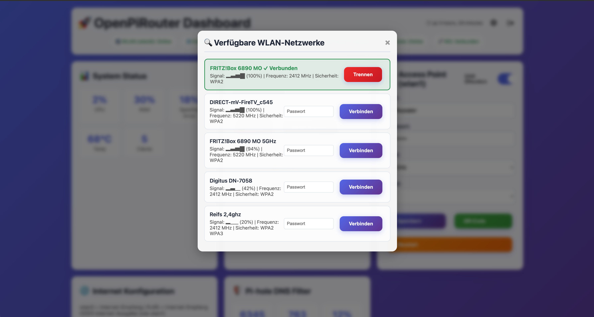

# 🚀 OpenPiRouter

**Transform your Raspberry Pi into a powerful, modern network router with real-time web management!**

OpenPiRouter is a complete router solution that turns your Raspberry Pi into a fully-featured network router with Access Point capabilities, Pi-hole ad-blocking, and a beautiful real-time web dashboard.


---

## 📸 Screenshots

### Main Dashboard


*Modern, responsive web dashboard with real-time updates via WebSocket*

### WiFi Scanner


*Built-in WiFi scanner with signal strength visualization and one-click connect*

---

## ✨ Features

### 🌐 Network Management
- **Dual WAN Support**: Internet via WLAN (wlan0) or Ethernet (RJ45)
- **Flexible RJ45 Port**: Use as internet input OR client output
- **Access Point (AP)**: Broadcast your own WiFi network (wlan1)
- **WiFi Scanner**: Built-in scanner with signal strength visualization
- **Connection Management**: Easy connect/disconnect from WiFi networks
- **SSID Visibility Toggle**: Make your AP public or hidden
- **Band Switching**: 2.4GHz / 5GHz support
- **QR Code Generation**: Quick client onboarding via QR code

### 📊 Monitoring & Statistics
- **Real-time System Stats**: CPU, RAM, Temperature, Storage
- **Live Internet Speed**: ↓ WAN Input / ↑ AP Output in Mbit/s
- **Pi-hole Integration**: DNS-level ad blocking statistics
- **Connected Clients**: View all WiFi and LAN clients with signal strength
- **Uptime Display**: System uptime tracking
- **WebSocket Updates**: Everything updates in real-time without page reloads

### 🎛️ System Control
- **Service Management**: Control hostapd, dnsmasq, Pi-hole
- **Config Export/Import**: Backup and restore your complete configuration
- **DHCP Lease Cleanup**: Remove old/inactive clients
- **System Reboot**: Restart your router remotely
- **Authentication**: Secure login system

### 💅 Modern UI/UX
- **WebSocket-powered**: Real-time updates without page reloads
- **Responsive Design**: Works on desktop, tablet, and mobile
- **Toast Notifications**: Beautiful SweetAlert2 notifications
- **Color-coded Status**: Instant visual feedback
- **Modal Dialogs**: Clean, modern interface elements
- **FontAwesome Icons**: Professional icon library

### 🎨 Theme System
- **Custom Themes**: Upload your own dashboard designs
- **Theme Manager**: Easy theme switching with preview images
- **Export/Import**: Download current theme as template
- **One-Click Activation**: Switch themes instantly
- **Example Themes**: Pre-built themes to get started
- **Full Customization**: Complete control over HTML/CSS/JS

---

## 📋 Requirements

### Hardware
- **Raspberry Pi 3/4/5** (recommended: Pi 4 with 2GB+ RAM)
- **2x WiFi Adapters**:
  - Internal WiFi (wlan1) for Access Point
  - External USB WiFi adapter (wlan0) for WAN connection
- **MicroSD Card**: 16GB+ (Class 10 or better)
- **Power Supply**: Official Raspberry Pi power supply recommended

### Software
- **Raspberry Pi OS** (Bullseye or newer, Lite or Desktop)
- **Python 3.7+**
- **Internet connection** (for initial setup)

---

## 🚀 Quick Start

### 1. Clone the Repository

```bash
git clone https://github.com/s3vdev/OpenPiRouter.git
cd OpenPiRouter
```

### 2. Configure Environment

Copy the example environment file and edit it with your credentials:

```bash
cp .env.example .env
nano .env
```

Set your passwords and preferences:
```env
DASHBOARD_PASSWORD=your_secure_password_here
PIHOLE_PASSWORD=your_pihole_password_here
DEFAULT_AP_SSID=OpenPiRouter
DEFAULT_AP_PASSWORD=your_wifi_password_here
WIFI_COUNTRY=DE
```

### 3. Run Installation

**⚠️ Warning: This script will make significant system changes!**

```bash
chmod +x install_complete.sh
sudo ./install_complete.sh
```

The installation will:
- ✅ Update system packages
- ✅ Install required dependencies (hostapd, dnsmasq, Pi-hole, etc.)
- ✅ Configure network interfaces (wlan0, wlan1, eth0)
- ✅ Set up systemd services
- ✅ Deploy the web dashboard
- ✅ Configure firewall rules (iptables)

⏱️ **Installation time**: ~20-30 minutes

### 4. Access Dashboard

After installation and reboot:

```
http://192.168.50.1:8080
```

**Default Login**: Use the password you set in `.env`

---

## 📖 Configuration

### Network Interfaces

- **wlan0**: WAN (Internet Input via WiFi)
- **wlan1**: Access Point (192.168.50.1)
- **eth0**: Configurable (Internet Input OR Client Output)

### Default Settings

| Setting | Default Value |
|---------|--------------|
| AP IP | 192.168.50.1 |
| AP Subnet | 192.168.50.0/24 |
| DHCP Range | 192.168.50.50 - 192.168.50.150 |
| Web Port | 8080 |
| DNS | Pi-hole (if installed) |

### Changing Settings

All settings can be modified through the web dashboard:
1. **Internet Configuration**: Choose WAN source (wlan0/eth0)
2. **Access Point**: SSID, password, channel, band, visibility
3. **DHCP Settings**: IP range and lease time
4. **Pi-hole**: Enable/disable ad-blocking

---

## 🔧 Advanced Usage

### Export Configuration

```bash
# Via Dashboard: System Menu → Konfiguration Exportieren
# Downloads: pi-router-config.yaml
```

### Import Configuration

```bash
# Via Dashboard: System Menu → Konfiguration Importieren
# Upload your pi-router-config.yaml
```

### Theme Management

**Create Custom Themes:**

```bash
# 1. Export current theme via Dashboard
# Theme Manager (🎨) → "Aktuelles Theme Exportieren"

# 2. Extract and customize
unzip openpirouter_theme_*.zip
cd openpirouter_theme_*/

# Edit template.html with your changes
nano template.html

# Add a screenshot
cp your_screenshot.png screenshot.png

# Update metadata
nano meta.json

# 3. Re-zip and upload
cd ..
zip -r my_custom_theme.zip openpirouter_theme_*/

# 4. Upload via Theme Manager
# Theme Manager → "Theme Hochladen" → Select ZIP
```

**Example themes** available in `example_themes/` directory.

See [example_themes/README.md](example_themes/README.md) for detailed theme development guide.

### Manual Service Control

```bash
# Restart Dashboard
sudo systemctl restart pi-config

# Check Dashboard Status
sudo systemctl status pi-config

# View Logs
sudo journalctl -u pi-config -f

# Restart Access Point
sudo systemctl restart hostapd

# Restart DNS/DHCP
sudo systemctl restart dnsmasq
```

### Update Dashboard

```bash
cd OpenPiRouter
git pull
sudo cp modern_dashboard.py /opt/pi-config/web.py
sudo systemctl restart pi-config
```

---

## 🛠️ Troubleshooting

### Dashboard not accessible?

```bash
# Check if service is running
sudo systemctl status pi-config

# Check logs
sudo journalctl -u pi-config -n 50

# Verify port is listening
sudo netstat -tulpn | grep 8080
```

### WiFi not working?

```bash
# Check hostapd
sudo systemctl status hostapd

# Check if wlan1 is up
ip addr show wlan1

# Verify iptables rules
sudo iptables -t nat -L -v -n
```

### No Internet on clients?

```bash
# Check IP forwarding
cat /proc/sys/net/ipv4/ip_forward  # Should be: 1

# Test DNS
nslookup google.com 192.168.50.1

# Check dnsmasq
sudo systemctl status dnsmasq
```

### Pi-hole not showing stats?

```bash
# Restart Pi-hole FTL
sudo systemctl restart pihole-FTL

# Check database
sudo sqlite3 /etc/pihole/pihole-FTL.db "SELECT * FROM counters;"
```

---

## 🏗️ Architecture

```
Internet
   ↓
[wlan0/eth0] ← WAN Input
   ↓
[Raspberry Pi Router]
├── iptables (NAT/Firewall)
├── dnsmasq (DHCP/DNS)
├── hostapd (Access Point)
├── Pi-hole (Ad-blocking)
└── Flask Dashboard (WebSocket)
   ↓
[wlan1/eth0] ← AP Output
   ↓
Connected Clients
```

---

## 📦 Technology Stack

- **Backend**: Python 3, Flask, Flask-SocketIO
- **Frontend**: HTML5, CSS3, JavaScript (ES6+), WebSockets
- **Network**: hostapd, dnsmasq, NetworkManager, iptables
- **Monitoring**: psutil, SQLite3 (Pi-hole DB)
- **UI**: SweetAlert2, FontAwesome
- **Configuration**: YAML, python-dotenv

---

## 🤝 Contributing

Contributions are welcome! Please feel free to submit a Pull Request.

1. Fork the repository
2. Create your feature branch (`git checkout -b feature/AmazingFeature`)
3. Commit your changes (`git commit -m 'Add some AmazingFeature'`)
4. Push to the branch (`git push origin feature/AmazingFeature`)
5. Open a Pull Request

---

## 📄 License

This project is licensed under the MIT License - see the [LICENSE](LICENSE) file for details.

---

## 🙏 Acknowledgments

- [Pi-hole](https://pi-hole.net/) - Network-wide ad blocking
- [Flask](https://flask.palletsprojects.com/) - Python web framework
- [SweetAlert2](https://sweetalert2.github.io/) - Beautiful popup boxes
- [FontAwesome](https://fontawesome.com/) - Icon library
- The Raspberry Pi Foundation

---

## 📞 Support

- **Issues**: [GitHub Issues](https://github.com/s3vdev/OpenPiRouter/issues)
- **Discussions**: [GitHub Discussions](https://github.com/s3vdev/OpenPiRouter/discussions)

---

## ⚠️ Disclaimer

This software is provided "as is", without warranty of any kind. Use at your own risk. Always test in a safe environment before deploying to production.

---

**Made with ❤️ for the Raspberry Pi community**

